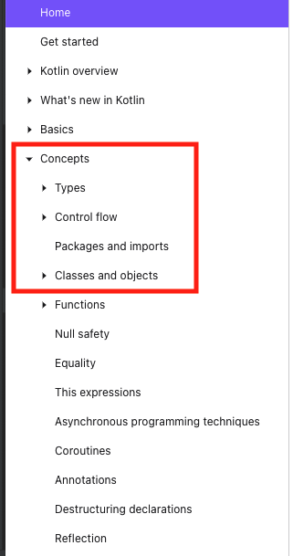

# kotlin-basic
코틀린 언어 학습에 대한 내용 정리

---
## 회의록
#### [최초 모임 회의록(2021.12.12 11:00)](https://github.com/kotlin-serverside-study/kotlin-basic/wiki/%5B211212%5D-1%ED%9A%8C-Meeting-%ED%9A%8C%EC%9D%98%EB%A1%9D)

---

## Week1
### 1주차 학습주제
> 자유 양식으로 markdown 파일을 각자 디렉토리에 Push
* [Kotlin 공식 문서](https://kotlinlang.org/docs/home.html)의 **Concept** 기준 "Classes and Object" 까지의 학습 관련 주제
* 

# Kotlin Type

## Number type
* 기본 타입 -> numbers, booleans, characters, strings, and arrays
* Number 타입에는 Int,Long,Short,Byte,Float,Double 이 있다. 
  일반적으로는 Int 타입으로 추론되서 생성되고 뒤에 L을 붙이면 Long 타입으로 생성된다. 
  소수에서는 Double 타입으로 추론되서 생성되고 뒤에 f를 붙이면 float 타입으로 생성된다.

## Array type
* arrayOf()로 배열 생성 

### 코틀린에서 주의 사항 
kotlin에서는 변수를 선언 할 때 Null 값을 가질 수 가 없다.
그렇게 함으로써 컴파일시 Null error 체크를 해서 runtime시에 NullPointerException을 방지 할 수 있다.

* Null값을 허용하기 위해서는 Type 뒤에 ?를 붙인다. Int?, Long?

JVM에서 동작하게 되면 Int, float, String 등은 자바의 원시 타입으로 생성된다.
하지만 Int?, float? 등은 자바의 참조 타입으로 생성된다.

### 코틀린의 독특한 특징
JVM 에서 Integer 참조를 불러올때 -128 ~ 127 값들은 힙에 저장되는 것이아니라 캐시메모리에 저장된다.
ex)
val a: Int = 100
val boxedA: Int? = a
val anotherBoxedA: Int? = a

val b: Int = 10000
val boxedB: Int? = b
val anotherBoxedB: Int? = b

println(boxedA === anotherBoxedA) // true
println(boxedB === anotherBoxedB) // false

## 명시적 형변환
* toType() 이용해서 형변환
* 작은 type에서 큰 type으로 형변환은 불가 (반대는 가능)
* 서로 다른 type끼리 연산을 하게 되면 큰 type으로 형변환 된다.
* as를 사용해서 형변환도 가능

## type check 
* 스마트 캐스트 -> 사용자가 원하는 타입으로 캐스팅 하지 않더라도 컴파일러가 자동으로 캐스팅 해주는것
* is 사용(kotlin에서 is 연산자는 단순히 type 체크만 하는것이 아닌 형변환까지 해준다.)
fun demo(x: Any) {
    if (x is String) {
        print(x.length) // x is automatically cast to String
    }
}

"""
### type erase
generic 타입은 컴파일
제네릭 장점 : 컴파일 타임에 타입에 대한 안정성 보장 
ex) 제네릭 타입으로 지정된 변수는 컴파일 시 타입 체크를 한다.
그래서 런타임시 ClassCastException 과 같은 uncheckedException을 방지 할 수 있다.

제네릭 타입, 로타입 -> 로타입은 제네릭 타입에서 매개변수를 사용x

실체화 불가 타입 -> runtime에 타입정보를 가지고 있지 않고 compile 시 타입 정보를 소거, 실체화 타입 -> runtime에 타입정보 가지고 있음 
"""

## Class Constructor
* kotlin 에서 class 생성하면 class Name constructor(name: type) 이런식으로 생성자 사용 (앞에 constructor 생략도 가능)
but 괄호 안에서 다른 내용은 못 넣는다. 넣고 싶으면 init 을 활용
* kotlin 은 생성자 영역이 존재x 따라서 this.변수 = 생성자 매개변수 활용 x

* 생성자가 여러개 필요한 경우 추후에 알아볼 constructor를 사용할 수도 있지만 파라미터에 default 값을 줘서 필요에 따라 생성하게 할 수도 있다.
Ex) class Person(val name: String, val age: Int=20, val height: Int=300)
이렇게 age와 height에 default 값을 주게 되면, name프로퍼티는 필수로 필요하고 age와 height는 선택적으로 주입해 생성할 수 있다.
val person = Person("conas") ➡️ person = 이름:conas, 나이: 20, 키: 300
val person = Person("conas", height=150) ➡️ person = 이름:conas, 나이=20, 키=300

* 주생성자에서 변수 초기화를 안하면 프로퍼티 생성하지 않는다. 
* 하지만 val,var로 변수를 초기화 시켜주면 자동으로 프로퍼티 생성

*부생성자 
* 주 생성자에서는 constructor 을 생략 가능했지만 부생성자에서는 생략 불가능 
또한 부생성자에서는 constructor 에서 변수 초기화 불가(val, var x)
부생성자를 사용 할 시 주생성자를 항상 불러와야 한다.

## properties
* 프로퍼티는 자바의 field + getter/setter 메소드
* val은 불변(immutable)이기 때문에 getter만 생성
* var은 변하기(mutable) 때문에 setter/getter가 모두 생성
* private 변수는 getter/setter가 생성되지 않습니다.

var stringRepresentation: String
    get() = this.toString()
    set(value) {
        setDataFromString(value) // parses the string and assigns values to other properties
    }

var counter = 0 // the initializer assigns the backing field directly
    set(value) {
        if (value >= 0)
            field = value
            // counter = value // ERROR StackOverflow: Using actual name 'counter' would make setter recursive
    }
    
field 는 프로퍼티이 값을 메모리에 잠시 저장하기 위해 사용하는것으로 선언할 필요가 없이 자동적으로 생성
접근자중 하나 이상을 사용하면 자동으로 생성
counter = value 를 하게 되면 재귀적으로 계속해서 호출해서 스택오버플로 발생 
따라서 field = value 라고 해야한다.

const 는 컴파일 시간에 결정되는 상수, val은 runtime시 할당

const는 클래스 생성자 할당 x , 문자역이나 기본 자료형만 할당
따라서 const 는 클래스 프로퍼티와 지여변수 할당 x

## 상속 
kotlin은 any 클래스를 기본적으로 상속 받고 있다
그리고 기본적인 class들은 final 이여서 상속되어 질 수 없다.
open을 앞에 붙여야 상속 할 수 있따.

상속 받은 클래스에서 상속 클래스의 생성자를 항상 호출 
class MyView : View {
    constructor(ctx: Context) : super(ctx)

    constructor(ctx: Context, attrs: AttributeSet) : super(ctx, attrs)
}

override 하기 위한 조건 -> 상위 클래스에서  override 할 함수앞에 open && 그리고 subclass 에서 override 작성

